     

 

  

# 🛡️ Awesome AI Watermark Detection & Provenance Ecosystem

> **A curated collection of SaaS platforms, API services, and Open-Source tools for AI-generated content detection, invisible watermarks (SynthID), C2PA / Content Credentials verification, and deepfake media forensics.**

---

## 📌 Overview & Key Features

This repository tracks notable commercial **SaaS platforms** and **open-source projects** dedicated to **AI Watermark Detection** and digital media provenance verification. As generative AI models proliferate across image, audio, video, and text modalities, verifying content origin and detecting synthetic manipulation has become paramount for Trust & Safety, journalism, and enterprise security.

These tools enable verification via:
* 🔒 **Signed C2PA / Content Credentials Manifests**: Cryptographic origin verification and metadata lineage tracking.
* ✨ **Invisible Watermarks**: Embedded mathematical traces (e.g. Google SynthID, Meta Watermark-Anything, Stable Signature).
* 🤖 **Forensic Classifiers & Deepfake Models**: Probabilistic machine learning detection when manifests or watermarks are missing.
* 📋 **Metadata Extraction**: EXIF, IPTC, and generator signature analysis.

---

## 📚 Table of Contents

- [📊 SaaS Market Overview](#-saas-market-overview)
- [🏢 SaaS & Hosted Commercial Platforms](#-saas--hosted-commercial-platforms)
- [📦 Open-Source GitHub Projects](#-open-source-github-projects)
- [🏗️ Architectural Guidance & Composable Stacks](#%EF%B8%8F-architectural-guidance--composable-stacks)
- [🤝 How to Contribute](#-how-to-contribute)
- [⚖️ Disclaimer & Standards Note](#%EF%B8%8F-disclaimer--standards-note)
- [📈 Star History](#-star-history)
- [💖 Support & Community](#-support--community)

---

## 📊 SaaS Market Overview

> 💡 **Market Size & Structure:** The global AI Detection, Watermarking & Content Provenance market is estimated at **$1.85 Billion in 2026** and projected to grow to **$8.6 Billion by 2030** (CAGR of ~36%). The sector is currently **highly fragmented** with specialized niche vendors across visual, audio, and textual forensics, though consolidating around open standard protocols like C2PA and multi-modal enterprise API platforms.

---

## 🏢 SaaS & Hosted Commercial Platforms

Below are leading commercial platforms offering enterprise-grade AI content detection, deepfake analysis, and provenance verification APIs.

| Company / Platform 🏢 | Company Size / Valuation 💰 | Capabilities & Description 🔍 | Starting Pricing Tier 🏷️ | Free Tier / Trial Limits 🎁 |
| :--- | :--- | :--- | :--- | :--- |
| **[Adobe Content Credentials / C2PA Verify](https://contentauthenticity.org/)** | **$220B+** *(Market Cap)* | Signed Content Credentials (C2PA) manifest verification, cryptographic origin tracking & visual metadata inspector. | Included with Creative Cloud ($22.99/mo) | **Free C2PA Verify Web Tool** *(Unlimited browser checks)* |
| **[Hive AI](https://thehive.ai/)** | **$2.0B** *(Valuation / $120M+ Funding)* | Multi-modal AI moderation & detection suite (Image, Video, Audio, and Text AI detection APIs). | $0.0015 / API request *($15/mo minimum)* | **1,000 free API credits** / month |
| **[Reality Defender](https://www.realitydefender.com/)** | **$250M** *(Valuation / $30M+ Funding)* | Enterprise multi-modal deepfake & synthetic media detection platform across image, video, audio & text. | Pro Plan starts at $49 / month | **14-day free trial** *(Up to 50 media scans)* |
| **[Truepic](https://www.truepic.com/)** | **$150M** *(Valuation / $40M+ Funding)* | Cryptographic media provenance, digital seal validation & C2PA manifest verification engine. | Developer Plan starts at $29 / month | **Free Developer Tier** *(100 verifications / month)* |
| **[Sensity AI](https://sensity.ai/)** | **$35M** *(Valuation / $5M+ Funding)* | Deepfake threat intelligence, facial manipulation detection & synthetic video verification API. | Starter API Tier starts at €99 / month | **7-day free trial** *(Up to 25 video/image analyses)* |
| **[Optic / GetReal Security](https://www.getrealsecurity.com/)** | **$20M** *(Valuation / $4.5M Funding)* | AI-generated image & video detection platform for platforms, trust & safety, and digital forensics. | Starter Tier starts at $19 / month | **Free Starter Tier** *(30 media scans / month)* |
| **[Attestiv](https://attestiv.com/)** | **$15M** *(Valuation / $3.5M Funding)* | Tamper-proof media verification, photo authenticity scoring & document provenance tracking. | Essentials Tier starts at $39 / month | **Free Starter Tier** *(20 photo/doc verifications / mo)* |
| **[DeepMedia](https://deepmedia.ai/)** | **$12M** *(Valuation / $2.5M Funding)* | AI audio & video deepfake detection API (DeepID), voice clone detection & synthetic media forensic scoring. | Starter API Plan starts at $25 / month | **Free Developer Plan** *(50 mins audio/video scanning / mo)* |

---

## 📦 Open-Source GitHub Projects

Top open-source projects for building custom, privacy-first, or local-first AI watermark and provenance verification pipelines. Sorted by GitHub Star Count (Descending).

| Repository 📦 | GitHub Stars ⭐ | Description & Key Features 📝 | Primary Tech Stack 💻 |
| :--- | :---: | :--- | :--- |
| **[facebookresearch/watermark-anything](https://github.com/facebookresearch/watermark-anything)** |  | Meta Research's unified framework for imperceptible image watermarking and localized detection. | Python / PyTorch |
| **[contentauth/c2pa-rs](https://github.com/contentauth/c2pa-rs)** |  | Official Rust SDK for reading, writing, and validating C2PA Content Credentials manifests. | Rust |
| **[lynote-ai/ai-image-detector](https://github.com/lynote-ai/ai-image-detector)** |  | Open-source probabilistic AI-generated image detection engine and CLIP forensic benchmark suite. | Python / PyTorch |
| **[MatrixA/aicheck](https://github.com/MatrixA/aicheck)** |  | Offline CLI tool for detecting AI-generated images, video & audio via metadata and invisible watermark extraction. | Go |
| **[c2pa-org/specifications](https://github.com/c2pa-org/specifications)** |  | Formal C2PA technical specification standards and manifest architecture for digital provenance. | Markdown / Schema |
| **[contentauth/c2patool](https://github.com/contentauth/c2patool)** |  | Official Command-Line Interface (CLI) for inspecting, validating, and injecting C2PA metadata into media. | Rust / CLI |
| **[LAION-AI/watermark-detection](https://github.com/LAION-AI/watermark-detection)** |  | Datasets, model weights, and training tools for visible/invisible watermark classification by LAION. | Python / PyTorch |
| **[contentauth/c2pa-js](https://github.com/contentauth/c2pa-js)** |  | JavaScript / WebAssembly SDK for validating Content Credentials manifests in Web browsers and Node.js. | TypeScript / WASM |
| **[cpeoples/ai-watermark-detector](https://github.com/cpeoples/ai-watermark-detector)** |  | Research-oriented Rust CLI for analyzing text watermarking schemes (SynthID, KGW, Unigram) & C2PA verification. | Rust |
| **[kylosarc/watermark](https://github.com/kylosarc/watermark)** |  | Privacy-focused, local-first browser UI for inspecting C2PA credentials without uploading assets. | TypeScript / React |

---

## 🏗️ Architectural Guidance & Composable Stacks

When building enterprise verification workflows or Trust & Safety infrastructure:

1. **Cryptographic Provenance First (C2PA)**: Implement `c2patool` or `c2pa-rs` to check for signed Content Credentials manifests. If a valid signature exists, content origin can be cryptographically verified.
2. **Invisible Watermark Extraction**: Run local/offline watermark extraction tools (e.g. `watermark-anything` or `aicheck`) to check for statistical or frequency-domain watermarks (such as SynthID or Stable Signature).
3. **Probabilistic AI Classification**: When no watermark or C2PA manifest is present, fall back to probabilistic deepfake/synthetic classifiers (e.g., `ai-image-detector` or commercial APIs like Hive AI / Reality Defender) for risk scoring.
4. **Human-in-the-Loop**: High-stakes decisions (journalism, legal claims, moderation enforcement) should combine multi-signal detection scores with human oversight.

---

## 🤝 How to Contribute

Contributions to expand this list are very welcome!

1. **Fork** this repository.
2. Edit `README.md` following the tabular format.
3. Ensure added SaaS options include specific starting prices and exact free tier limits, or open-source options include tech stack details.
4. Submit a **Pull Request** with a clear title and summary.

Check out [Awesome Lists Collection](https://github.com/ishandutta2007/Awesome-Awesome-Awesome) for more curated tech lists.

---

## ⚖️ Disclaimer & Standards Note

* This repository is a **community-curated index** and does not constitute formal endorsement.
* AI watermark detection and synthetic media classification are **probabilistic**. Absence of a watermark does not guarantee content is human-created, nor does the presence of a C2PA manifest prove every claim within it is truthful.
* Adversarial editing, heavy compression, or re-encoding can degrade invisible watermarks. Always maintain multi-layered defense and auditability.

---

## 📈 Star History

---

## 💖 Support & Community

Thank you for visiting **Awesome AI Watermark Detection**! If this repository has helped your research, verification workflows, or security architecture, please consider supporting:

- ⭐ **Star this repository** to help others discover it!
- 🍴 **Fork it** to contribute new SaaS platforms or open-source projects.
- 📢 **Share it** with journalists, developers, and Trust & Safety researchers.
- ☕ **Sponsor / Buy me a coffee**: Support maintenance via [GitHub Sponsors](https://github.com/sponsors/ishandutta2007).
